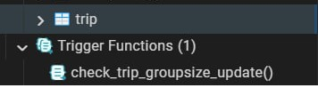
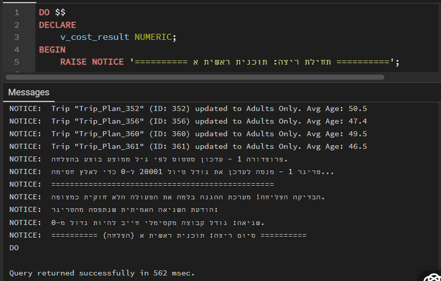
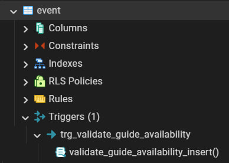
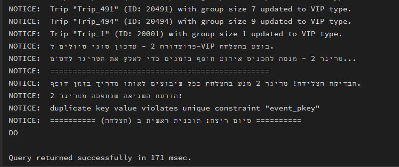

# 🌍 TripManager Pro
### Group Trip and Event Management System

**Contributors:** Neomi Golkin & Shirel Cohen

### 📑 Table of Contents
* [Phase 1: Design and Build the Database](#phase-1)
  * [Introduction](#introduction)
  * [ERD (Entity-Relationship Diagram)](#erd)
  * [DSD (Data Structure Diagram)](#dsd)
  * [SQL Scripts](#scripts)
  * [Data](#data)
  * [Backup](#backup)
* [Phase 2: Queries](#phase-2)
* [Phase 3: Integration](#phase-3)
* [Phase 4: PL/pgSQL Development](#phase-4)

## Phase 1: Design and Build the Database 

### 📝 Project Overview 
The **Group Trip and Event Management System** is designed to efficiently manage information related to travel groups, professional guides, participants, and scheduled itineraries. 

> This system ensures smooth organization and tracking of essential details such as group assignments, guide expertise, and real-time trip logistics.

---

### 🎯 Purpose of the Database
This database serves as a structured and reliable solution for travel agencies and tour operators to:

* 📍 **Organize Travel Groups** – Link groups to specific participants and itineraries seamlessly.
* 👨‍🏫 **Manage Professional Guides** – Track regional specializations, experience, and contact details.
* 🗺️ **Plan & Monitor Trips** – Ensure proper guide allocation and real-time status tracking across regions.
* 📅 **Schedule Events** – Maintain a detailed and organized timeline for activities within each trip.
* 📂 **Centralized Directory** – Manage locations, points of interest, and comprehensive participant data.

---

### 🚀 Potential Use Cases

| Role | Responsibility |
| :--- | :--- |
| **Administrators** | Oversee operations, allocate resources, and manage directories. |
| **Tour Guides** | Access assigned trips and manage event schedules based on expertise. |
| **Coordinators** | Track participant lists and ensure logistics align with group needs. |
| **Operations Staff** | Maintain real-time records and communication between all parties. |

---

### 💡 Summary
This structured database helps **streamline tour and event operations**, improving logistical efficiency, guide-to-region matching, and communication among all stakeholders involved in group travel.

-----

### ERD (Entity-Relationship Diagram) 

### DSD (Data Structure Diagram) 

### SQL Scripts 

Provide the following SQL scripts:

* **Create Tables Script** - The SQL script for creating the database tables is available in the repository:
  📜 [createTables.sql](./Phase1/scripts/method1/createTables.sql)

* **Insert Data Script** - The SQL script for inserting data to the database tables is available in the repository:
  📜 [insertTables.sql](./Phase1/scripts/method1/insertTables.sql)

* **Drop Tables Script** - The SQL script for dropping all tables is available in the repository:
  📜 [dropTables.sql](./Phase1/dropTables.sql)

* **Select All Data Script** - The SQL script for selecting all tables is available in the repository:
  📜 [selectAll_tables.sql](./Phase1/dropTables.sql)
  
### Data

#### First tool: using mockaro to create csv file
[Entering a data to person table](./Phase1/scripts/method2/generateData)

#### Second tool: upload files.

#### Third tool: using python to create csv files

[Link to python file](./Phase1/scripts/method3/generateData/createTables.py)

### Backup & Restoration 

To ensure the durability and reliability of the **TripsManager** system, we implemented a complete logical backup and restoration strategy. This process ensures that all data, including complex table relationships and constraints, are preserved.

The full backup file, containing all schema definitions and records, is stored here:  
[backup1.sql](./Backup/backup1.sql)

#### The Verification Process
We verified the backup by performing a full restore into a clean environment:
1. **Export:** A logical dump was created using `pg_dump`.
2. **Import:** The backup was restored into a separate database named `test_restore_db`.
3. **Validation:** We confirmed that the row counts and foreign key constraints were fully intact.[cite: 1]

**1. Backup Process Success:**  
*Confirmation that the backup file was generated successfully without errors.*  

**2. Restoration Process Success:**  
*Confirmation that the system was able to reconstruct the database from the backup file.*  

## Phase 2: Querying, Optimization, and Data Control 

In this phase of the project, we focused on advanced, hands-on operations with our database. We executed complex `SELECT` queries, which included performance analysis and comparing the efficiency of different query structures. We also performed conditional `UPDATE` and `DELETE` operations while strictly maintaining Referential Integrity.

Additionally, we enhanced the system's reliability by implementing Constraints to prevent invalid data entry. We significantly improved query execution times by creating Indexes, and demonstrated safe data manipulation using transaction control (`Rollback` & `Commit`). 
All SQL files for this phase, along with the updated backup file (`backup2`), are located in the `Phase2` folder.

📄 **[To view the full Phase B Project Report (including execution screenshots, efficiency analysis, and performance proofs) - Click Here](./Phase2/Project_Report.md)**

## Phase 3: Integration 
Their ERD

Integration ERD

# Database Integration & System Unification Report

This document outlines the design decisions, engineering strategies, and physical database operations performed during the system integration stage. The goal was to unify two independently developed database branches into a single, global enterprise schema using PostgreSQL.

---

## 1. Project Background & Unification Objectives
The primary objective of the integration phase was to merge two distinct subsystems:
1. **The Core Logistics Branch:** Responsible for managing trips, scheduling, and destination events.
2. **The Personnel & Resource Management Branch:** Responsible for managing participant registrations, group assignments, and tour guides.

The main technical challenges involved preventing primary key collisions, adapting schema constraints to prevent data loss during merging, and enforcing global referential integrity across both domains without disrupting historical data records.

---

## 2. Key Architectural Decisions

### A. Core Base Table Strategy & Schema Expansion (`ALTER TABLE`)
Instead of rewriting the entire system architecture from scratch, a strategic decision was made to designate `trip`, `event`, `participant`, and `guide` as the **Global Base Tables**. 
* **Implementation:** Data from the secondary branch was systematically ingested into these parent tables.
* **Schema Extension:** To support the unique domain attributes of the secondary branch, the core tables were dynamically extended using `ALTER TABLE ... ADD COLUMN` (e.g., adding `birthdate` to the participant schema, and `groupsize` or `status` attributes to the trip model).

### B. Resolving Primary Key Conflicts Using a 20,000 ID Offset
Since both database branches were developed in parallel, both environments independently generated auto-incremented primary keys starting from `1`, `2`, `3`, etc. Simply appending records would have caused catastrophic `Unique Constraint Violations`.
* **Decision:** A fixed numerical **offset of 20,000** was applied to all incoming Primary Keys (IDs) extracted from the secondary branch during the ETL process.
* **Preserving Referential Integrity:** To maintain correct table relationships, this exact same offset was simultaneously applied to corresponding Foreign Keys during data migration (e.g., in the `event` table, `trip_id` was transformed to `trip_id + 20000` to guarantee that events remained correctly linked to their migrated parent trips).

### C. Constraint Relaxation (`DROP NOT NULL`)
In the original standalone schemas, columns such as `triptype` or `locationid` were strictly bounded by `NOT NULL` constraints. However, data incoming from the secondary branch lacked these fields natively.
* **Decision:** We utilized `ALTER COLUMN ... DROP NOT NULL` statements to allow these attributes to accept `NULL` values globally. This defensive modeling decision prevented the integration pipeline from failing due to legacy data gaps.

### D. Guide Entity Consolidation & Data Fallbacks (`COALESCE`)
In the secondary system branch, tour guides were structured under a different operational logic, with their personal details mapped directly inside a general participant schema.
* **Decision:** During the data ingestion phase, a `LEFT JOIN` was executed between the `guides` and `participants` source tables. To handle missing name fields gracefully, the SQL query implemented a string concatenation fallback: `COALESCE(p.first_name || ' ' || p.last_name, 'Unknown')`. This ensured that if an integrated guide record lacked a defined name, the pipeline inserted `'Unknown'` rather than causing a null-pointer database crash.

---

## 3. Detailed Step-by-Step Integration Pipeline

### Step 1: Definition of Unique Domain Tables (`CREATE TABLE`)
New relational models were instantiated to house entity types that were entirely unique to one branch and had no prior equivalent in the base schema, such as `route`, `transport_type`, `schedule`, and `action`.
* **Key Commands:** `CREATE TABLE IF NOT EXISTS` ensures idempotency, preventing execution errors during script re-runs. Composite Primary Keys—such as `PRIMARY KEY (trip_id, order_num)` in the `schedule` table—were explicitly declared to ensure sequence uniqueness within each discrete trip scope.

### Step 2: Parent Base Schema Realignment (`ALTER TABLE`)
The core tables were structurally adjusted to match the unified entity definitions, adding missing attributes and stripping restrictive constraints as described in the architectural design decisions.
* **Key Commands:** * `ALTER TABLE ... ADD COLUMN IF NOT EXISTS` safely injects new attributes without altering existing column data.
  * `ALTER TABLE ... ALTER COLUMN ... DROP NOT NULL` relaxes constraint rules for cross-system rows.

### Step 3: Extract, Transform, Load - Data Migration (`INSERT INTO ... SELECT`)
This represents the physical ETL layer of the unification. Rows were extracted from the old legacy models (plural notation, e.g., `trips`), transformed via key offsets (`+ 20000`), and loaded directly into the unified global tables (singular notation, e.g., `trip`).
* **Key Commands:** A combination of target `INSERT INTO` declarations bound with relational source `SELECT` queries allowed real-time data translation during the ingestion flow.

### Step 4: Re-Enforcing Relational Integrity (`ADD CONSTRAINT FOREIGN KEY`)
During the bulk loading phase in Step 3, cross-table foreign key validations were temporarily omitted to allow seamless record insertions independent of execution order. Once all datasets were loaded and synchronized, the final referential integrity rules were hardcoded.
* **Key Commands:** `ALTER TABLE ... ADD CONSTRAINT ... FOREIGN KEY (...) REFERENCES ...` locked down the database schema. This step ensures that future transactions cannot violate business rules (e.g., adding a sub-`action` that points to a non-existent parent `event`).

### Step 5: Post-Integration Database Cleansing (`DROP TABLE ... CASCADE`)
Once audit checks verified that 100% of the historical records were safely transformed and migrated into the global schema, the redundant, duplicate staging tables from the secondary branch were decommissioned.
* **Key Commands:** `DROP TABLE IF EXISTS ... CASCADE`. The inclusion of the **`CASCADE`** modifier is a vital component here; it instructs PostgreSQL to drop the obsolete tables along with any old associated view structures, triggers, or index keys, leaving behind a clean, high-performance, unified database environment.
*

### System Views & Verification Artifacts
### Our View

[Queries](./Phase3/otherProjectView.sql)

 

 

 

### Their View

[Queries](./Phase3/ourProjectView.sql)

 

 

 

---

### Backup Registry

[backup3](./Phase3/backup3)
### Phase 4: PL/pgSQL Development 

This phase covers the development and verification of non-trivial PL/pgSQL programs integrated into the database architecture.

---

#### 📜 [Functions Code File](./Phase4/Functions.sql)

##### 🔹 Function 1: Trip Total Cost Calculation
* **Description:** Calculates the total estimated cost of a trip by multipling route distance and compiling explicit cursor records of scheduled event costs. Includes validation exceptions.

  

* **Exception Handling Verification:**

  

 

##### 🔹 Function 2: Filter Trips by Region (Ref Cursor)
* **Description:** Dynamically generates and returns a ref cursor containing all scheduled trips within a specified geographic area, integrating input parameter validation.

  

* **Exception Handling Verification:**

  

---

#### 📜 [Procedures Code File](./Phase4/Procedures.sql)

##### 🔸 Procedure 1: Bulk Update Trip Status by Group Age
* **Description:** Automatically processes all trips via an implicit cursor loop, calculates participant age averages, and updates statuses accordingly with notice logs.

  

 

##### 🔸 Procedure 2: Allocate VIP Trip Type
* **Description:** Scans database records and automatically re-evaluates trip classifications, updating small group sizes ($\le 10$ participants) to 'VIP' status.

* **Execution Verification (Before and After):**

###### 1. Initial State (Before Execution):

  

###### 2. Procedure Call and Notice Outputs:

  

###### 3. Final State Verification (After Execution):

  

---

---

#### 📜 [Triggers Code File](./Phase4/Triggers.sql)

##### 🔹 Trigger 1: Group Size Hard Limit Validation
* **Description:** Automatically prevents updating a trip's maximum group size to an invalid value (less than or equal to 0) or to a value lower than the actual number of currently registered participants found in database relations.

  

* **Exception Handling Verification:**

  

 

##### 🔹 Trigger 2: Guide Overbooking Prevention
* **Description:** Monitors event scheduling during data insertions, automatically ensuring that the assigned guide does not have any other conflicting events at the exact same date and time.

  

* **Exception Handling Verification:**

  

---

#### 📜 [Main Execution Programs File](./Phase4/MainPrograms.sql)

##### 💻 Main Program 1: Costing, Age Evaluation & Capacity Guard
* **Description:** An atomic orchestration block that compiles the trip budget, updates the age demographics logs via the implicit cursor, and triggers the hard capacity guard to verify the transaction boundary state.

* **Execution Runtime Logs & Verification:**

  

 

##### 💻 Main Program 2: Regional Dispatch, VIP Classification & Schedule Validation
* **Description:** Opens a dynamic reference cursor to stream localized trip workflows, executes batch VIP upgrades for low-capacity metrics, and forces a scheduling collision to assert database exception recovery.

* **Execution Runtime Logs & Verification:**

  

