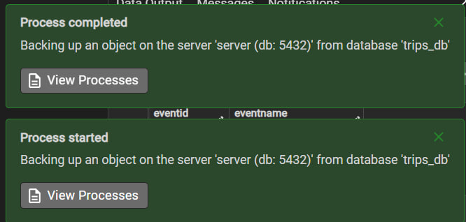
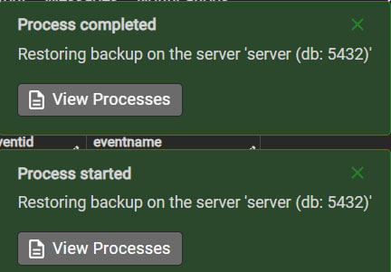

# 🌍 TripManager Pro
### Group Trip and Event Management System

**Contributors:** Neomi Golkin & Shirel Cohen

### 📑 Table of Contents
* [Phase 1: Design and Build the Database](#phase-1)
  * [Introduction](#introduction)
  * [ERD (Entity-Relationship Diagram)](#erd)
  * [DSD (Data Structure Diagram)](#dsd)
  * [SQL Scripts](#scripts)
  * [Data](#data)
  * [Backup](#backup)
* [Phase 2: Integration](#phase-2)

## Phase 1: Design and Build the Database 

### 📝 Project Overview 
The **Group Trip and Event Management System** is designed to efficiently manage information related to travel groups, professional guides, participants, and scheduled itineraries. 

> This system ensures smooth organization and tracking of essential details such as group assignments, guide expertise, and real-time trip logistics.

---

### 🎯 Purpose of the Database
This database serves as a structured and reliable solution for travel agencies and tour operators to:

* 📍 **Organize Travel Groups** – Link groups to specific participants and itineraries seamlessly.
* 👨‍🏫 **Manage Professional Guides** – Track regional specializations, experience, and contact details.
* 🗺️ **Plan & Monitor Trips** – Ensure proper guide allocation and real-time status tracking across regions.
* 📅 **Schedule Events** – Maintain a detailed and organized timeline for activities within each trip.
* 📂 **Centralized Directory** – Manage locations, points of interest, and comprehensive participant data.

---

### 🚀 Potential Use Cases

| Role | Responsibility |
| :--- | :--- |
| **Administrators** | Oversee operations, allocate resources, and manage directories. |
| **Tour Guides** | Access assigned trips and manage event schedules based on expertise. |
| **Coordinators** | Track participant lists and ensure logistics align with group needs. |
| **Operations Staff** | Maintain real-time records and communication between all parties. |

---

### 💡 Summary
This structured database helps **streamline tour and event operations**, improving logistical efficiency, guide-to-region matching, and communication among all stakeholders involved in group travel.

-----

### ERD (Entity-Relationship Diagram) 

### DSD (Data Structure Diagram) 

### SQL Scripts 

Provide the following SQL scripts:

* **Create Tables Script** - The SQL script for creating the database tables is available in the repository:
  📜 [createTables.sql](./Phase1/scripts/method1/createTables.sql)

* **Insert Data Script** - The SQL script for inserting data to the database tables is available in the repository:
  📜 [insertTables.sql](./Phase1/scripts/method1/insertTables.sql)

* **Drop Tables Script** - The SQL script for dropping all tables is available in the repository:
  📜 [dropTables.sql](./Phase1/dropTables.sql)

* **Select All Data Script** - The SQL script for selecting all tables is available in the repository:
  📜 [selectAll_tables.sql](./Phase1/dropTables.sql)
  
### Data

#### First tool: using mockaro to create csv file
[Entering a data to person table](./Phase1/scripts/method2/generateData)

#### Second tool: upload files.

#### Third tool: using python to create csv files

[Link to python file](./Phase1/scripts/method3/generateData/createTables.py)

### Backup & Restoration 

To ensure the durability and reliability of the **TripsManager** system, we implemented a complete logical backup and restoration strategy. This process ensures that all data, including complex table relationships and constraints, are preserved.

The full backup file, containing all schema definitions and records, is stored here:  
[backup1.sql](./Backup/backup1.sql)

#### The Verification Process
We verified the backup by performing a full restore into a clean environment:
1. **Export:** A logical dump was created using `pg_dump`.
2. **Import:** The backup was restored into a separate database named `test_restore_db`.
3. **Validation:** We confirmed that the row counts and foreign key constraints were fully intact.[cite: 1]

**1. Backup Process Success:**  
*Confirmation that the backup file was generated successfully without errors.*  

**2. Restoration Process Success:**  
*Confirmation that the system was able to reconstruct the database from the backup file.*  

## Phase 2: Querying, Optimization, and Data Control

In this phase of the project, we focused on advanced, hands-on operations with our database. We executed complex `SELECT` queries, which included performance analysis and comparing the efficiency of different query structures. We also performed conditional `UPDATE` and `DELETE` operations while strictly maintaining Referential Integrity.

Additionally, we enhanced the system's reliability by implementing Constraints to prevent invalid data entry. We significantly improved query execution times by creating Indexes, and demonstrated safe data manipulation using transaction control (`Rollback` & `Commit`). 
All SQL files for this phase, along with the updated backup file (`backup2`), are located in the `Phase2` folder.

📄 **[To view the full Phase B Project Report (including execution screenshots, efficiency analysis, and performance proofs) - Click Here](./Phase2/Project_Report.md)**